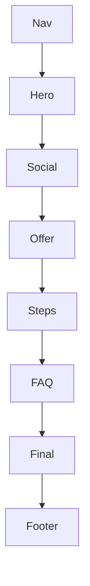

<!-- BD_DEMO: borrar este bloque y reemplazar con contenido real. -->

# Wireframe — {{TITLE}}

> Esto es un **ejemplo de estructura**. Bórralo y deja el wireframe aprobado (Mermaid u outline numerado).

## Qué se espera

- Orden de secciones de arriba a abajo.
- Qué va en el **primer viewport** (hero budget): marca + 1 headline + 1 frase + CTA + 1 imagen dominante. Sin cards/stats en el hero.
- Interacciones (FAQ, modal sucursal, sticky CTA, carrusel…) solo si aplican.
- Un diagrama Mermaid o lista numerada clara.

## Ejemplo (demo — reemplazar)

1. Nav — logo + CTA
2. Hero — oferta + precio + CTA + imagen producto
3. Social proof — 3 datos
4. Oferta / producto — detalle
5. Steps — cómo pedir
6. FAQ
7. CTA final
8. Footer + sucursales
9. Sticky CTA (mobile)



## Prompt sugerido (otro chat)

```
Eres diseñador de landings de conversión para Bodecatta BBQ.
Crea un wireframe en markdown para la campaña "{{TITLE}}" (slug: {{SLUG}}).

Restricciones de branding:
- Primer viewport = una composición: marca, un headline, una frase, un grupo CTA, una imagen dominante edge-to-edge. Sin cards ni stats en el hero.
- Una sección = un propósito.
- CTA principal por WhatsApp multi-sucursal (SLP) si aplica pedido.

Devuelve:
1) lista numerada de secciones con 1 línea de intención cada una
2) diagrama mermaid flowchart
3) notas de mobile (sticky CTA sí/no)

NO inventes copy final. NO uses la etiqueta BD_DEMO en la salida.
```
