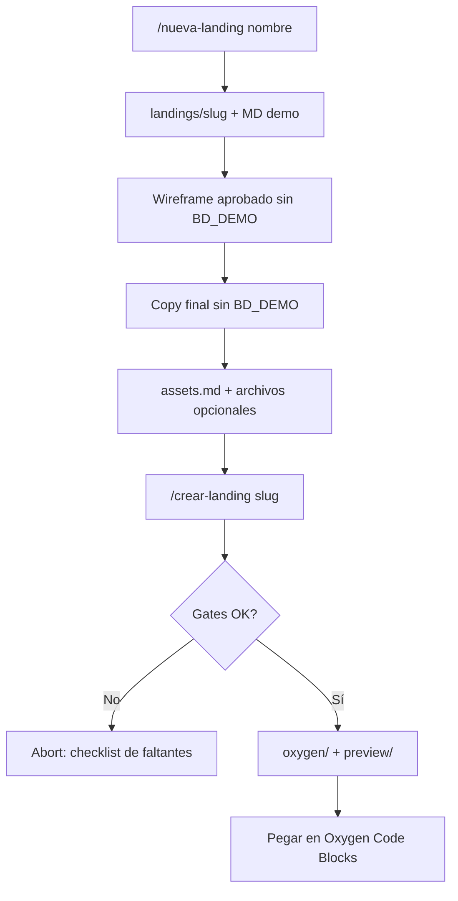

# Workflow: de idea a Oxygen

## Skills

Canónicas en `.agents/skills/` (también vía `/nueva-landing` o `/crear-landing` según el IDE).

| Skill | Input | Output |
|-------|-------|--------|
| `nueva-landing` | Nombre | Carpeta + templates con `BD_DEMO` + prompts sugeridos |
| `crear-landing` | Path o slug | `markup.php` + CSS + JS (+ preview) |

Ver [`.agents/README.md`](../.agents/README.md) y [`AGENTS.md`](../AGENTS.md).

## Qué bloquea `/crear-landing`

- Carpeta inexistente
- Faltan MD de brief
- `BD_DEMO` aún en README / wireframe / copy

## Qué NO bloquea

- Imágenes o video ausentes → logo shared o placeholder
