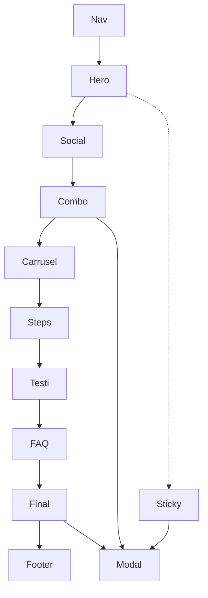

# Wireframe — Smash Burger Mex

Estado: aprobado (referencia).

## Secciones (orden)

1. **Nav** — logo + CTA “Pedir ahora”
2. **Hero** — brand/producto + headline + hook + precio $148 + CTA + imagen full-bleed del producto (sin cards)
3. **Social proof** — 3 métricas (rating, pedidos, quote corto)
4. **Combo** — qué incluye ($148) con 2 bloques visuales (carne + papas) + CTA
5. **Carrusel** — hamburguesas del menú con precio + CTA por item
6. **Steps** — 3 pasos para pedir
7. **Testimonios** — 3 quotes
8. **FAQ** — accordion 4 preguntas
9. **CTA final** — cierre + precio + CTA
10. **Footer** — logo + 3 sucursales + WhatsApp
11. **Sticky CTA** — mobile
12. **Modal sucursal** — picker WhatsApp (The Park / 7B / WTC)

